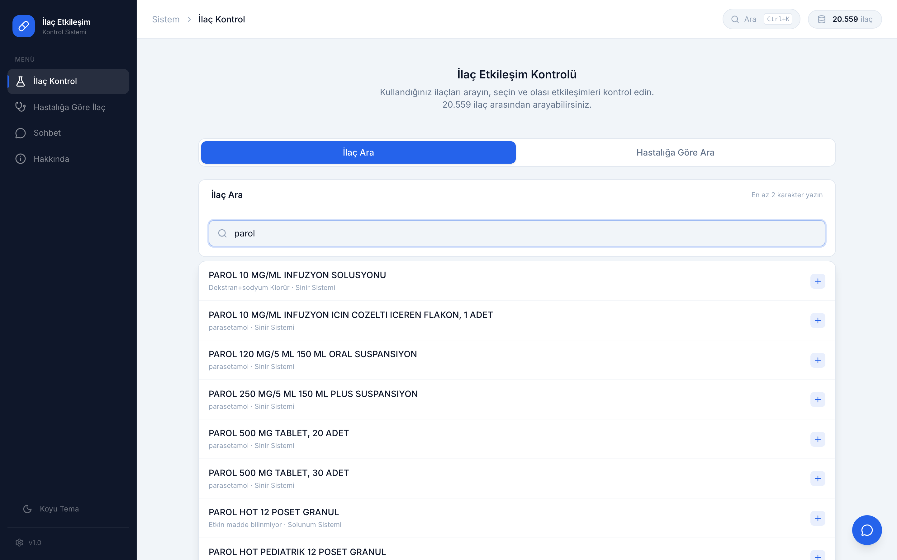

# ilac360

Open-source drug interaction checker for the Turkish pharmaceutical market. Live at [ilac360.com](https://ilac360.com).

Turkey has more than 20,000 registered drug products, but no free tool that understands Turkish brand names well. Most existing solutions rely on US or UK naming, which often does not match what is prescribed here.

ilac360 lets you search the Turkish market, select up to 10 drugs, and see possible interactions instantly — risk levels, active ingredients, ATC codes, and a printable report.

The app runs entirely in the browser. No backend, no accounts, no tracking. The drug data is loaded once and queried locally.



---

## Features

- Search across ~20,000 drug products in the Turkish market (by brand name, active ingredient, or barcode)
- Condition-based search with 80+ mapped indications and prospectus fallback
- Interaction analysis with four risk levels (critical, high, medium, low)
- Active ingredient + ATC-code rule engine
- Printable interaction report
- Dark mode

---

## Stack

- React 19, Vite 8, Tailwind CSS 4
- Pure client-side: a single static bundle plus JSON data files
- No server, no database, no API keys

---

## Data

Source data lives in `data/`:

| File                     | Content                                              |
|--------------------------|------------------------------------------------------|
| `ilaclar-dataset.json`   | ~20.000 drug records from the Turkish drug database  |
| `interactions.json`      | Hand-curated interaction rules                       |
| `condition-mapping.json` | Condition → drug-class mapping for indication search |

`scripts/build-data.mjs` reads these and writes minimized JSON into `client/public/data/`:

- `drugs-index.json` — slim records for in-memory search
- `drugs-descriptions.json` — leaflet text keyed by drug ID
- `interactions.json`, `condition-mapping.json` — copied verbatim

The build also backfills missing ATC codes by mapping each drug's active ingredient to the most common ATC seen elsewhere in the dataset.

---

## Local Development

Requires Node.js 20+.

```bash
cd client && npm install
cd .. && npm run build:data    # generates client/public/data/*
npm run dev                    # starts Vite dev server on :5173
```

---

## Production Build

```bash
npm run build
```

This regenerates the data files, builds the client into `client/dist/`, and mirrors the output to `dist/` at the repo root for static deployment.

The contents of `dist/` can be uploaded to any static host (Netlify, Vercel, Hostinger static, GitHub Pages, plain S3 + CloudFront, etc.). No runtime is needed.

---

## Project Layout

```
client/        React app (Vite)
data/          Source data (drug records, interaction rules, conditions)
scripts/       Data build script
dist/          Production build output (committed for static deploy)
```

---

## Contributing

Pull requests are welcome — especially for:

- New interaction rules in `data/interactions.json`
- Additional condition mappings in `data/condition-mapping.json`
- UI fixes and accessibility improvements

Please keep the rule engine and the UI separate. Interaction logic lives in [`client/src/data/interactionEngine.js`](client/src/data/interactionEngine.js).

---

## Disclaimer

This tool is for informational purposes only. It is not medical advice and not a substitute for professional clinical judgment. Always consult your doctor or pharmacist before making decisions about medications.

---

## License

[MIT](LICENSE) © 2026 Ahmet Yiğit
