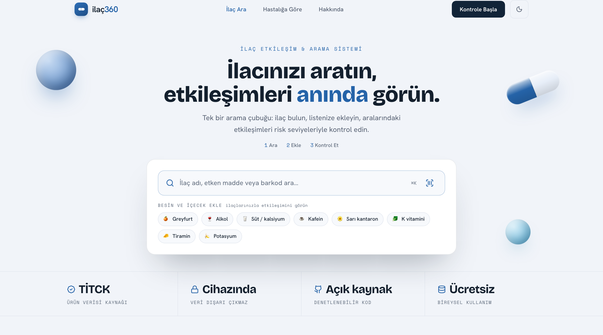

# ilaç360

Drug interaction checker for the Turkish pharmaceutical market. Search 20,000+ Turkish drug products, build a list of up to 10, and check them against sourced interaction rules. Everything runs in the browser: no backend, no accounts, no tracking.

Live at [ilac360.com](https://ilac360.com).




## Background

Turkey has over 20,000 registered drug products, but the free interaction checkers most people reach for are built around US or UK drug names. Searching for a Turkish brand like *Coraspin*, *Majezik* or *Delix* usually returns nothing.

ilaç360 is built directly on the Turkish market dataset. The source data is compiled at build time into static JSON, loaded once, and queried locally, so a patient's medication list never leaves the device.

## Features

- Search 20,559 products by brand name, active ingredient, or barcode, including camera barcode scanning
- Interaction analysis with six risk levels (critical / high / medium / low / unknown / info) and a severity legend
- Condition-based search over 80+ mapped indications, with a leaflet full-text fallback
- 228 sourced clinical warnings: pregnancy, lactation, pediatric, geriatric, food, allergy, driving
- Optional local profile (age band, sex, pregnancy, breastfeeding) that lifts the relevant warnings to the top; nothing is ever hidden
- Per-product link to the original TİTCK leaflet
- Printable report, dark mode, and an installable PWA that works offline after first load

## Interaction engine

Matching runs on active-ingredient *components*, not raw strings. Each product's ingredient field is normalized into canonical components: combination products are split, salt forms are stripped, and spelling variants are mapped through a synonym table. Rules then match on exact component equality.

This avoids the common failure mode where a naive substring match links unrelated ingredients (for example `asetilsalisilik asit` against `salisilik asit`). The dataset ships 277 rules at ingredient-pair and ATC-class level. Every rule carries a `source`, and CI fails the build if fewer than 95% of rule ingredients resolve against real dataset components.

The engine and matcher live in [`client/src/data/`](client/src/data/) (`interactionEngine.js`, `ingredientMatcher.js`), kept separate from the UI and covered by unit tests. [docs/architecture.md](docs/architecture.md) documents the resolution order.

## Data pipeline

[`scripts/build-data.mjs`](scripts/build-data.mjs) compiles the 55 MB source dataset into content-hashed JSON under `client/public/data/`, resolved through `manifest.json`:

- `drugs-index.<hash>.json` — slim records for in-memory search
- `drugs-desc-NN.<hash>.json` — leaflet text split across 512 hash buckets, so a drug card fetches a single ~180 KB file instead of the whole corpus
- `interactions`, `drug-warnings`, `condition-mapping`, `ingredient-synonyms`

Hashed filenames let every data file be cached immutably at the edge. The build also backfills missing ATC codes from the most common code seen for each ingredient elsewhere in the dataset.

## Stack

- React 19, Tailwind CSS 4, Vite 8
- `vite-plugin-pwa` (Workbox) for offline caching
- `barcode-detector` with a `zxing-wasm` fallback for scanning
- No server, database, or API keys; the build output is fully static

## Development

Requires Node.js 22 (`.nvmrc`) and [Git LFS](https://git-lfs.com) — the 55 MB source dataset is stored in LFS, so run `git lfs install` before cloning.

```bash
npm run setup        # install client dependencies
npm run build:data   # generate client/public/data/* and manifest.json
npm run dev          # Vite dev server on :5173
npm test             # Vitest
npm run smoke-test   # data integrity checks
```

CI runs on every push ([.github/workflows/ci.yml](.github/workflows/ci.yml)): ESLint, 29 Vitest suites with V8 coverage, the data smoke test, the rule/supplement/warning linters, a 95% rule-coverage gate, and a full production build.

## Build and deploy

```bash
npm run build
```

This regenerates the data, builds the client into `client/dist/`, and mirrors it to `dist/` for static hosting (`dist/` is not committed). The output drops onto any static host; a tuned `.htaccess` for Apache/LiteSpeed hosts ships inside the build, and content-hashed data files are safe to cache immutably.

## Project layout

```
client/   React app: components, data engine + stores, tests
data/     Source data: drug records (Git LFS), rules, warnings, synonyms, conditions
scripts/  Data build, linters, coverage gates, smoke test
docs/     Architecture, data-refresh runbook, deploy guides
```

## Disclaimer

For informational purposes only. Not medical advice, and not a substitute for professional clinical judgment. Always consult a doctor or pharmacist before making decisions about medications.

## License

Code: [MIT](LICENSE) © 2026 Ahmet Yiğit.

The MIT license covers the code only, not the bundled data. `data/ilaclar-dataset.json` is derived from TİTCK (Turkish Medicines and Medical Devices Agency) public product data and is subject to TİTCK's own terms; verify them before redistributing or using the data commercially. See [data/LICENSE-DATA.md](data/LICENSE-DATA.md) for the full sourcing policy.
